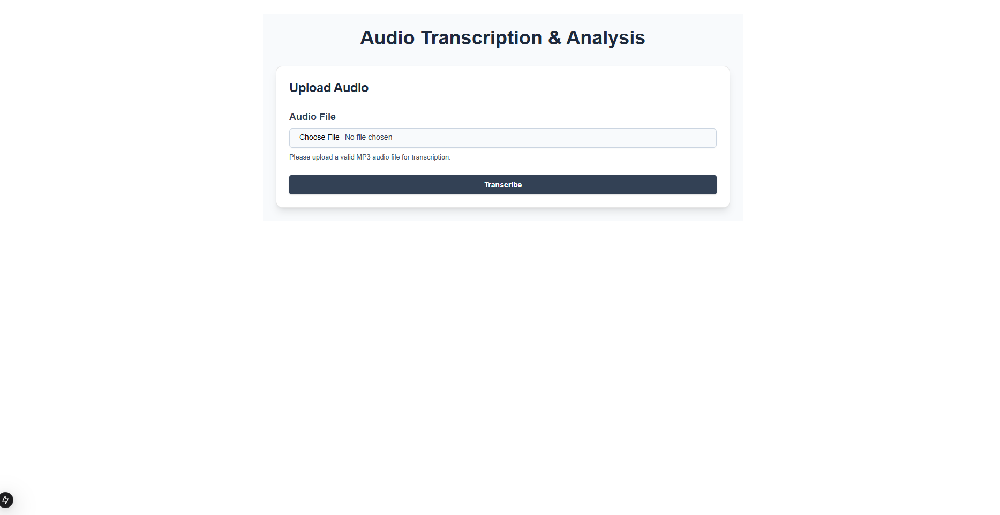
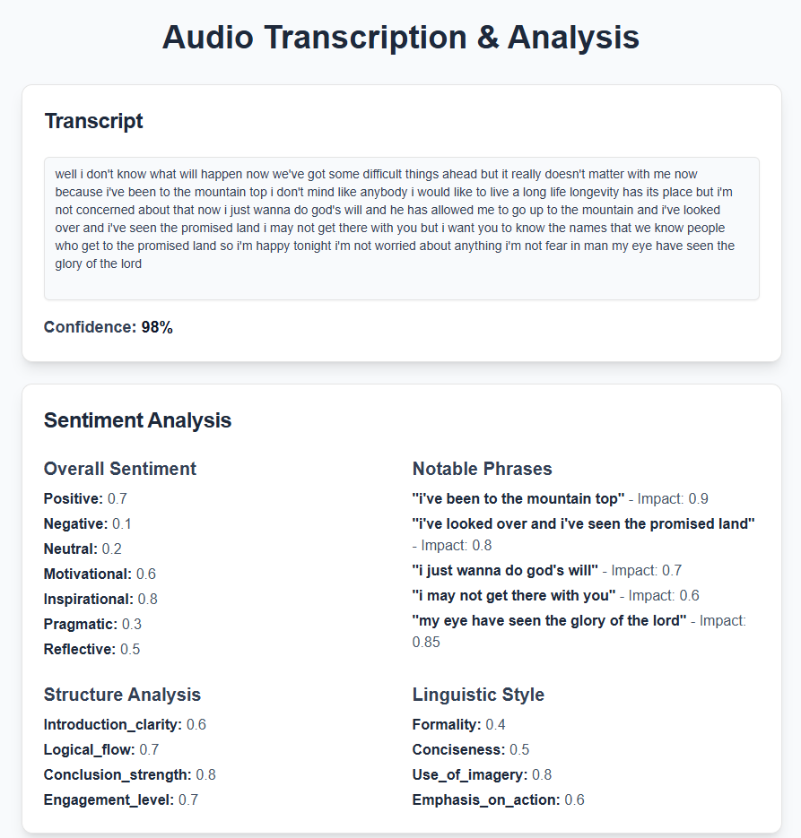

# Speech Transcription & Sentiment Analysis Tool

This project provides a powerful tool for transcribing speech and analyzing sentiment to help improve public speaking. By analyzing key elements such as motivational tone, structure, and impact, it provides actionable insights for speakers.

## Features

- **Speech-to-Text Transcription:** Convert audio to text with high accuracy.
- **Sentiment Analysis:** Identify positive, motivational, inspirational, and other emotional tones in the speech.
- **Impactful Phrases:** Detect phrases with high impact for improving speech effectiveness.
- **Structure & Style Evaluation:** Gain insights into speech clarity, flow, engagement, and style.

## Installation

1. **Clone the repository**  
    ```bash
    git clone https://github.com/yourusername/yourproject.git
    cd yourproject
    ```

2. **Install dependencies**  
    ```bash
    npm install
    ```

3. **Run the development server**  
    ```bash
    npm run dev
    ```

4. **View in browser**  
    Open [http://localhost:3000](http://localhost:3000) to see the project.

## Screenshots


## Add Audio File

To analyze a speech, you need to upload an audio file. Follow these steps:

1. **Navigate to the homepage**  
    Open [http://localhost:3000](http://localhost:3000).

2. **Upload your audio file**  
    Click on the "Upload Audio" button and select the audio file you want to analyze.
    3. **Homepage Screenshot**  
        

3. **Start Analysis**  
    Once the file is uploaded, click on the "Transcribe" button to start the transcription and sentiment analysis process.

4. **View Results**  
    After the analysis is complete, you will see the transcription and sentiment analysis results on the screen.
